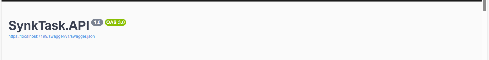
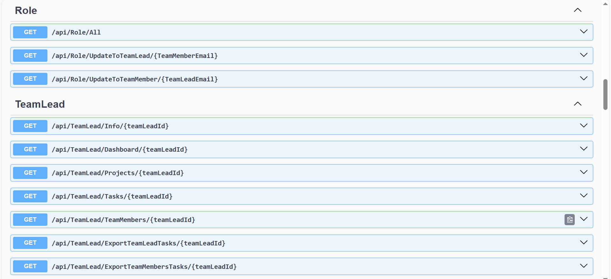
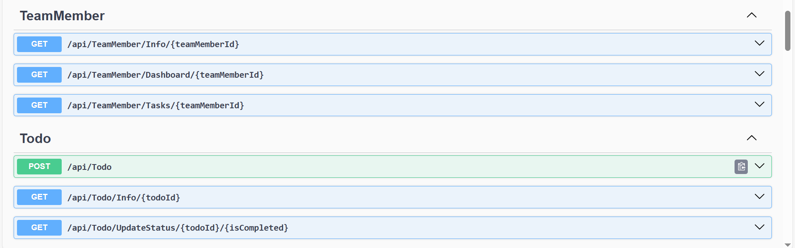

# Task Management System API



## Overview
This project is a **Task Management System API** built using **ASP.NET Core**. It is designed to manage projects, tasks, users, and roles with a clean and scalable backend architecture. The system supports task assignment, status tracking, notifications, and cloud-based file storage.

The project focuses on real-world backend concepts such as authentication, authorization, clean architecture, and third-party integrations.

---

## Features

### 🔐 Authentication & Authorization
- JWT-based authentication
- Role-based access control (Admin, Team Lead, Team Member)
- Secure access to protected endpoints

### 📂 Project Management
- Create, update, delete, and retrieve projects
- Assign users to projects
- Control project access based on user roles

### ✅ Task Management
- Create and assign tasks to team members
- Track task status (Pending, In Progress, Completed, Blocked)
- Set deadlines and monitor task progress
- Attach files to tasks

### 🔔 Notifications System
- Email notifications triggered by key events:
  - Task assignment
  - Task completion
  - Project member addition
- Notification rules to avoid unnecessary alerts
- Clear separation between notification logic and business logic

### ☁️ File Storage
- Integrated **Cloudinary** for cloud-based file storage
- Secure upload and management of task attachments
- Store and retrieve file URLs efficiently

---

## Architecture & Design

- Implemented **Unit of Work** pattern for clean data access and transactional consistency
- Used **Repository** pattern to separate business logic from data access
- Clean DTOs for request and response handling
- Proper entity-to-DTO mapping
- Clear separation of concerns across the application

### Error Handling
- Global exception handling middleware
- Consistent and meaningful error responses
- Improved API reliability and maintainability

---

## Technologies Used

- **ASP.NET Core Web API**
- **Entity Framework Core**
- **SQL Server** / **SQLite**
- **JWT Authentication**
- **Cloudinary** (File Storage)
- **C# Email Service** (SMTP)
- **Unit of Work & Repository Patterns**

---

## Getting Started

### Prerequisites
- .NET SDK
- SQL Server or SQLite
- Cloudinary account
- Email SMTP credentials

### Setup

1. Clone the repository
   ```bash
   git clone https://github.com/yourusername/task-management-api.git
   cd task-management-api
   ```

2. Configure the database connection string in `appsettings.json`

3. Add JWT settings (secret key, issuer, audience)

4. Configure Cloudinary credentials

5. Configure email service credentials

6. Apply database migrations
   ```bash
   dotnet ef database update
   ```

7. Run the project
   ```bash
   dotnet run
   ```

---

## API Highlights

- RESTful API design
- Proper HTTP status codes
- Input validation
- Secure endpoints using authorization policies

---

## Future Improvements

- [ ] Add in-app notifications
- [ ] Introduce background jobs for notifications
- [ ] Add unit and integration tests
- [ ] Containerize the application using Docker

---

## Purpose

This project was built to practice and demonstrate real-world backend development concepts, focusing on **scalability**, **clean architecture**, and **third-party integrations**.

---

## Contributing

Contributions are welcome! Please feel free to submit a Pull Request.

---

## Contact

For any questions or suggestions, please reach out to [mo7ammeda7medabdelmoneim@gmail.com](mailto:your-email@example.com)

---
## APIs




